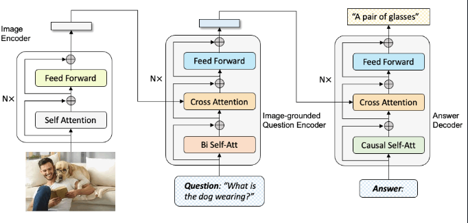
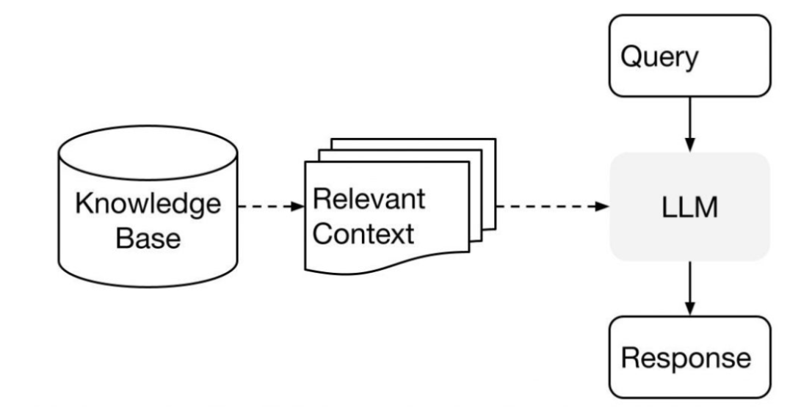
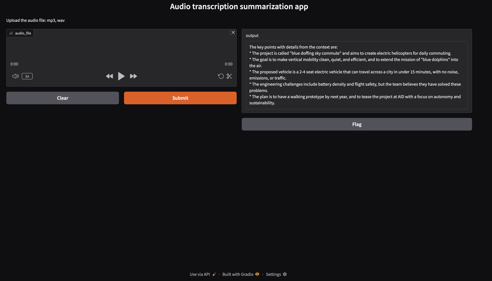

# Generative-ai-apps-python
Generative AI applications in Python

---
## 1. image-captioning-app
### [Description]
- This is a simple image captioning application that uses a pre-trained model to generate captions for images.

### [Language]
- Python<br>

### [Framework]
- Gradio.app

### [Model]
- BLIP (Bootstrapping Language-Image Pre-training)<br>
https://huggingface.co/Salesforce/blip-image-captioning-large
<br>

### [Apps]
1. image captioning app: upload an image and get a caption for it. (https://huggingface.co/spaces/CogitativePanda/img_captioning_app_blip_gradio)
2. automate web page image captioning: enter a URL, the app will fetch the images from it to generate captions. (https://huggingface.co/spaces/CogitativePanda/automate_url_captioner)

### [Demo]
- https://youtu.be/kH2kkC45CVU

### [Libs]
 - beautifulsoup: https://pypi.org/project/beautifulsoup4/
   - Beautiful Soup is a library that makes it easy to scrape information from web pages. It sits atop an HTML or XML parser, providing Pythonic idioms for iterating, searching, and modifying the parse tree.


### [Process]
1. Preprocessing
    ```
    inputs = processor(image, return_tensors="pt")
    ```
    - Resizes, normalizes, and converts the image into tensor format 
    - Adds attention masks and padding for the decoder


2. Encoding (Vision Transformer)
    ```
    vision_embeddings = model.vision_encoder(inputs["pixel_values"])
    ```
   - The image is split into patches → embedded → passed through ViT (Vision Transformer, e.g. ViT-B/16)
   - Outputs are rich visual feature vectors


3. Decoding (Text Generator)
    ```
    generated_ids = model.generate(**inputs)
    ```
    - The decoder receives the visual embeddings and begins generating tokens 
    - Uses autoregressive decoding: each predicted token is fed back into the model to predict the next


4. Postprocessing
    ```
    caption = processor.decode(generated_ids[0], skip_special_tokens=True)
    ```
    - Converts token IDs into a readable sentence
---
## 2. chatbot
### [Description]
- Simple Chatbot with Open Source LLM (facebook/blenderbot-400M-distill) using Python and Hugging Face.

### [Language]
- Python<br>

### [Framework]
- NA

### [Model]
- blenderbot-400M-distill: https://huggingface.co/facebook/blenderbot-400M-distill

### [Architecture]


### [Process]
1. Input processing
   
   When user send a message to the chatbot, the transformer helps process user's input. It breaks down user's message into smaller parts and represents them in a way that the chatbot can understand. Each part is called a token.
2. Understanding context

   The transformer passes these tokens to the LLM, which is a language model trained on lots of text data. The LLM has learned patterns and meanings from this data, so it tries to understand the context of user's message based on what it has learned.
3. Generating response

   Once the LLM understands user's message, it generates a response based on its understanding. The transformer then takes this response and converts it into a format that can be easily sent back to user.
4. Iterative conversation

   As the conversation continues, this process repeats. The transformer and LLM work together to process each new input message, understand the context, and generate a relevant response.
---
## 3. chatbot with voice assistance
### [Description]
- Chatbot with voice assistance powered by OpenAI's GPT model and Watson's Text-to-Speech & Speech-to-Text models

### [Language]
- Python<br>

### [Framework]
- Flask

### [Model]
- IBM Watson Speech TTS & STT models

  https://github.com/ibm-self-serve-assets/Watson-Speech
  - IBM Watson speech-to-text (STT)
  
    STT is an AI service that converts spoken language into written text using advanced machine learning techniques to for developing applications that require voice input, such as voice-controlled assistants, transcribing meetings, or enhancing customer support with voice commands. In STT, deep neural networks process audio signals to transcribe spoken words into text. These models are trained on diverse datasets, including different languages, accents, and speech in various environments, to improve recognition accuracy and adaptability.
    
    - Key features:
      - Real-time speech recognition: Watson STT can transcribe live audio as it's being spoken, which is crucial for interactive applications. 
      - Language and dialect support: STT supports multiple languages and dialects, making it versatile for global applications. 
      - Customization: Users can train the service with domain-specific terminology and speech patterns, improving accuracy for niche applications.
 
  - IBM Watson text-to-speech (TTS)
    
    TTS complements the STT service by converting written text into natural-sounding spoken audio. Watson's TTS is among the leading services that produce lifelike and expressive voice outputs. TTS technology has evolved from simple, robotic-sounding outputs to generating speech that closely mimics human tones and inflections. This is achieved through advanced deep learning models that understand text context, emotional cues, and linguistic nuances.
    - Key features:
      - Expressive and natural voices: TTS offers a variety of voices and languages that help to deliver output in accordance with user preferences. 
      - Emotion and expressiveness: TTS allows users to control the tone, emotion, and expressiveness of the voice output to suit the context of the conversation. 
      - Customization: Like STT, Watson TTS allows customization of voices and can be trained to include specific jargon or pronunciations unique to a business or industry.
---
## 4. generative AI-Powered Meeting Assistant
### [Description]
- A business AI Meeting Companion Speech-to-Text app that captures audio using OpenAI Whisper and summarize it using Llama 2 LLM

### [Language]
- Python<br>

### [Framework]
- Gradio.app

### [Model]
- OpenAI Whisper: https://openai.com/index/whisper/
  - Whisper is an automatic speech recognition (ASR) system trained on 680,000 hours of multilingual and multitask supervised data collected from the web. 
- Llama 2: https://huggingface.co/meta-llama/Llama-2-7b-chat-hf
  - Llama 2 is a collection of pretrained and fine-tuned generative text models ranging in scale from 7 billion to 70 billion parameters. This is the repository for the 7B fine-tuned model, optimized for dialogue use cases and converted for the Hugging Face Transformers format.

### [Apps]
https://huggingface.co/spaces/CogitativePanda/generative-AI-powered-meeting-assistant

### [Demo]
https://youtu.be/peYNlQHYQMQ


### [Libs]
- requests~=2.32.3 
- torch~=2.7.0 
- transformers~=4.51.3 
- gradio==5.23.2 
- langchain==0.0.343 
- ibm_watson_machine_learning==1.0.335 
- huggingface-hub>=0.28.1

### [Process]
- Speech-to-Text conversion: Utilize OpenAI's Whisper technology to convert meeting audio recordings into text, accurately.
- Content summarization: Implement IBM Watson's AI to effectively summarize the transcribed lectures and extract key points.
- User interface development: Create an intuitive and user-friendly interface using Hugging Face Gradio.
---
## 5. chatbot with RAG framework
### [Description]
- A chatbot that uses the RAG (Retrieval-Augmented Generation) framework to answer questions based on the uploaded PDF file.

### [Language]
- Python<br>

### [Framework]
- Flask

### [[Architecture]](https://www.linkedin.com/pulse/question-answer-bot-using-openai-langchain-faiss-satish-srinivasan/)<br>
- [Chroma](https://python.langchain.com/docs/integrations/vectorstores/chroma/): Chroma is a vector database that allows you to store and query embeddings efficiently. It is designed to work seamlessly with LangChain, making it easy to integrate into your applications.


### [Model]
- Embedding: sentence-transformers/all-MiniLM-L6-v2 (a.k.a. SBERT)
- LLM: meta-llama/llama-3-3-70b-instruct

### [Demo]


### [Libs]
- Flask==3.1.0 
- Flask_Cors==5.0.0 
- pdf2image==1.17.0 
- chromadb==0.4.24 
- pypdf==5.2.0 
- tiktoken==0.8.0 
- ibm-watsonx-ai==1.1.20 
- langchain-ibm==0.3.4 
- langchain==0.3.7 
- pydantic==2.10.1 
- pandas==1.5 
- atlassian-python-api==3.36.0 
- huggingface-hub==0.16.4 
- torch==2.0.1 
- sentence-transformers==2.2.2 
- InstructorEmbedding==1.0.0 
- p4python==2023.1.2454917 
- lxml==4.9.2 
- bs4==0.0.1
### [Process]
- process document: 
  - extract text from pdf, and split text into chunks.
  - embed chunks using sentence-transformers/all-MiniLM-L6-v2 model.
  - store chunks in Chroma vector database.
- process query:
  - embed query using sentence-transformers/all-MiniLM-L6-v2 model.
  - retrieve relevant chunks from Chroma vector database.
  - generate answer using meta-llama/llama-3-3-70b-instruct model with retrieved chunks as context.
  - update the conversation history with the query and answer.
  - return the answer to the user.
### [Tutorial]
- https://medium.com/the-power-of-ai/ibm-watsonx-ai-the-interface-and-api-e8e1c7227358
