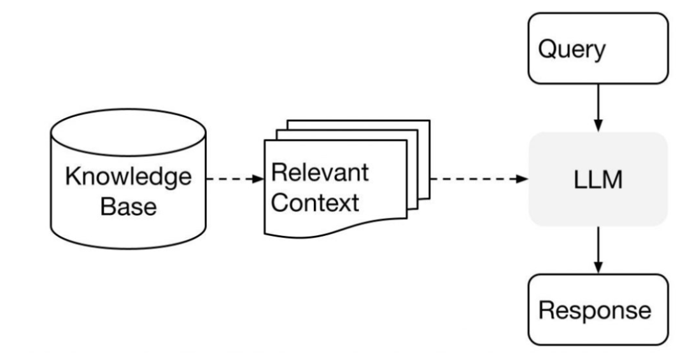

## chatbot
### [Description]
- Simple Chatbot with Open Source LLM (facebook/blenderbot-400M-distill) using Python and Hugging Face.

### [Language]
- Python 

### [Framework]
- NA

### [Model]
- blenderbot-400M-distill: https://huggingface.co/facebook/blenderbot-400M-distill

### [Architecture]

### [Process]
1. Input processing
   
   When user send a message to the chatbot, the transformer helps process user's input. It breaks down user's message into smaller parts and represents them in a way that the chatbot can understand. Each part is called a token.
2. Understanding context

   The transformer passes these tokens to the LLM, which is a language model trained on lots of text data. The LLM has learned patterns and meanings from this data, so it tries to understand the context of user's message based on what it has learned.
3. Generating response

   Once the LLM understands user's message, it generates a response based on its understanding. The transformer then takes this response and converts it into a format that can be easily sent back to user.
4. Iterative conversation

   As the conversation continues, this process repeats. The transformer and LLM work together to process each new input message, understand the context, and generate a relevant response.