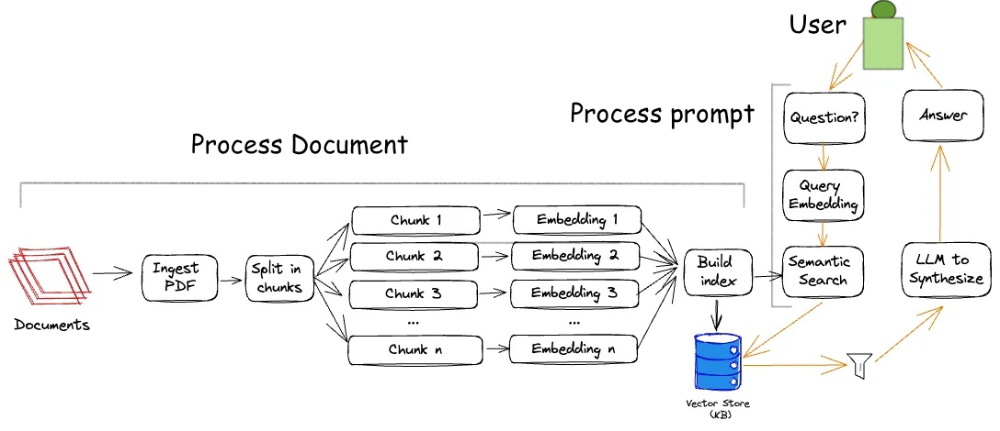
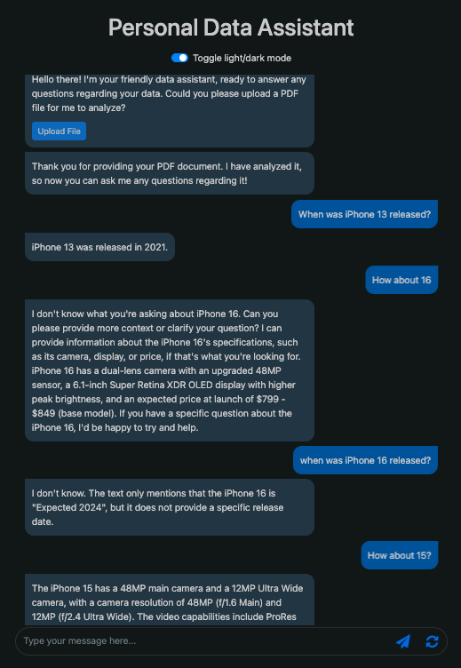

## chatbot with RAG framework
### [Description]
- A chatbot that uses the RAG (Retrieval-Augmented Generation) framework to answer questions based on the uploaded PDF file.

### [Language]
- Python 

### [Framework]
- Flask

### [[Architecture]](https://www.linkedin.com/pulse/question-answer-bot-using-openai-langchain-faiss-satish-srinivasan/) 
- [Chroma](https://python.langchain.com/docs/integrations/vectorstores/chroma/): Chroma is a vector database that allows you to store and query embeddings efficiently. It is designed to work seamlessly with LangChain, making it easy to integrate into your applications.

### [Model]
- Embedding: sentence-transformers/all-MiniLM-L6-v2 (a.k.a. SBERT)
- LLM: meta-llama/llama-3-3-70b-instruct

### [Demo]
- 
- https://youtu.be/ShTSqLMp-5M
- Note: there is room to be improved in the prompt engineering part --> when asked `How about 16`, the context is not retrieved correctly. This is hallucination!

### [Libs]
- Flask==3.1.0 
- Flask_Cors==5.0.0 
- pdf2image==1.17.0 
- chromadb==0.4.24 
- pypdf==5.2.0 
- tiktoken==0.8.0 
- ibm-watsonx-ai==1.1.20 
- langchain-ibm==0.3.4 
- langchain==0.3.7 
- pydantic==2.10.1 
- pandas==1.5 
- atlassian-python-api==3.36.0 
- huggingface-hub==0.16.4 
- torch==2.0.1 
- sentence-transformers==2.2.2 
- InstructorEmbedding==1.0.0 
- p4python==2023.1.2454917 
- lxml==4.9.2 
- bs4==0.0.1
### [Process]
- process document: 
  - extract text from pdf, and split text into chunks.
  - embed chunks using sentence-transformers/all-MiniLM-L6-v2 model.
  - store chunks in Chroma vector database.
- process query:
  - embed query using sentence-transformers/all-MiniLM-L6-v2 model.
  - retrieve relevant chunks from Chroma vector database.
  - generate answer using meta-llama/llama-3-3-70b-instruct model with retrieved chunks as context.
  - update the conversation history with the query and answer.
  - return the answer to the user.
### [Tutorial]
- https://medium.com/the-power-of-ai/ibm-watsonx-ai-the-interface-and-api-e8e1c7227358