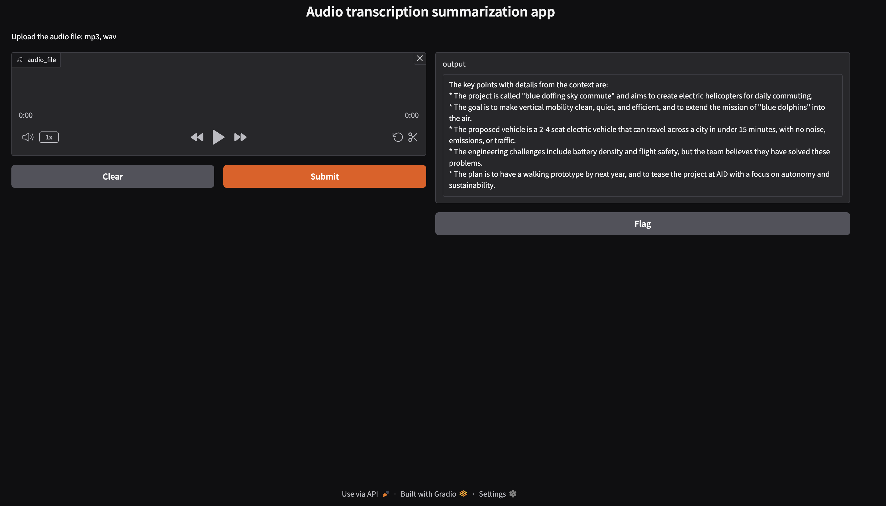

## generative AI-Powered Meeting Assistant
### [Description]
- A business AI Meeting Companion Speech-to-Text app that captures audio using OpenAI Whisper and summarize it using Llama 2 LLM

### [Language]
- Python 

### [Framework]
- Gradio.app

### [Model]
- OpenAI Whisper: https://openai.com/index/whisper/
  - Whisper is an automatic speech recognition (ASR) system trained on 680,000 hours of multilingual and multitask supervised data collected from the web. 
- Llama 2: https://huggingface.co/meta-llama/Llama-2-7b-chat-hf
  - Llama 2 is a collection of pretrained and fine-tuned generative text models ranging in scale from 7 billion to 70 billion parameters. This is the repository for the 7B fine-tuned model, optimized for dialogue use cases and converted for the Hugging Face Transformers format.

### [Apps]
https://huggingface.co/spaces/CogitativePanda/generative-AI-powered-meeting-assistant

### [Demo]
https://youtu.be/peYNlQHYQMQ

### [Libs]
- requests~=2.32.3 
- torch~=2.7.0 
- transformers~=4.51.3 
- gradio==5.23.2 
- langchain==0.0.343 
- ibm_watson_machine_learning==1.0.335 
- huggingface-hub>=0.28.1

### [Process]
- Speech-to-Text conversion: Utilize OpenAI's Whisper technology to convert meeting audio recordings into text, accurately.
- Content summarization: Implement IBM Watson's AI to effectively summarize the transcribed lectures and extract key points.
- User interface development: Create an intuitive and user-friendly interface using Hugging Face Gradio.