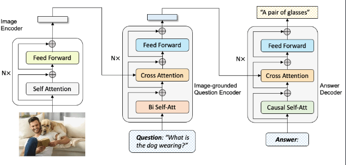

## image-captioning-app
### [Description]
- This is a simple image captioning application that uses a pre-trained model to generate captions for images.

### [Language]
- Python<br>

### [Framework]
- Gradio.app

### [Model]
- BLIP (Bootstrapping Language-Image Pre-training)<br>
https://huggingface.co/Salesforce/blip-image-captioning-large
  - BLIP is implemented in PyTorch and is designed to generate captions for images by combining vision and language understanding. 
  - It uses a Vision Transformer (ViT) for image encoding and a text generator for captioning.
  - example
  ```
   import torch
   import requests
   from PIL import Image
   from transformers import BlipProcessor, BlipForConditionalGeneration
   
   # Load processor and model
   processor = BlipProcessor.from_pretrained("Salesforce/blip-image-captioning-large")
   model = BlipForConditionalGeneration.from_pretrained("Salesforce/blip-image-captioning-large")
   
   # Move to GPU if available
   device = torch.device("cuda" if torch.cuda.is_available() else "cpu")
   model = model.to(device)
   
   # Load an image
   img = Image.open(requests.get("https://storage.googleapis.com/sfr-vision-language-research/BLIP/demo.jpg", stream=True).raw).convert("RGB")
   
   # Unconditional caption
   inputs = processor(img, return_tensors="pt").to(device)
   outputs = model.generate(**inputs)
   print(processor.decode(outputs[0], skip_special_tokens=True))
  ```
  <br>

### [Apps]
1. image captioning app: upload an image and get a caption for it. (https://huggingface.co/spaces/CogitativePanda/img_captioning_app_blip_gradio)
2. automate web page image captioning: enter a URL, the app will fetch the images from it to generate captions. (https://huggingface.co/spaces/CogitativePanda/automate_url_captioner)

### [Demo]
- https://youtu.be/kH2kkC45CVU

### [Libs]
 - beautifulsoup: https://pypi.org/project/beautifulsoup4/
   - Beautiful Soup is a library that makes it easy to scrape information from web pages. It sits atop an HTML or XML parser, providing Pythonic idioms for iterating, searching, and modifying the parse tree.


### [Process]
1. Preprocessing
    ```
    inputs = processor(image, return_tensors="pt")
    ```
    - Resizes, normalizes, and converts the image into tensor format 
    - Adds attention masks and padding for the decoder


2. Encoding (Vision Transformer)
    ```
    vision_embeddings = model.vision_encoder(inputs["pixel_values"])
    ```
   - The image is split into patches → embedded → passed through ViT (Vision Transformer, e.g. ViT-B/16)
   - Outputs are rich visual feature vectors


3. Decoding (Text Generator)
    ```
    generated_ids = model.generate(**inputs)
    ```
    - The decoder receives the visual embeddings and begins generating tokens 
    - Uses autoregressive decoding: each predicted token is fed back into the model to predict the next


4. Postprocessing
    ```
    caption = processor.decode(generated_ids[0], skip_special_tokens=True)
    ```
    - Converts token IDs into a readable sentence