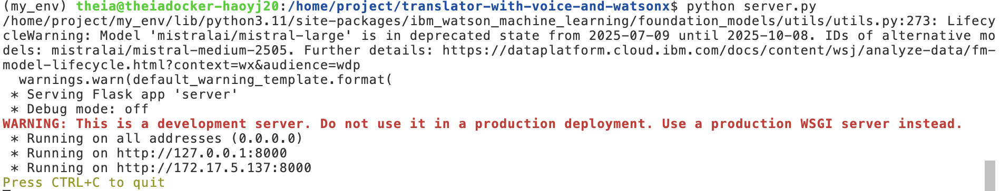

## voice enabled ai translator assistant
### [Description]
- A voice-enabled AI translator assistant that translates spoken language into another language using IBM Watson® Speech Libraries and Watsonx’s flan-ul2 model (LLM). The assistant can convert spoken English into French, providing a seamless translation experience.

### [Language]
- Python 

### [Framework]
- Flask

### [Model]
- IBM Watson® Speech Libraries for Embed: text-to-speech(tts) and speech-to-text(stt).
- Watsonx’s flan-ul2 model (LLM).

### [Process]
- speech-to-text: Convert spoken language into text (English).
- translation: Use the LLM to translate the text into the desired language (English to French).
- text-to-speech: Convert the translated text back into spoken language (French).

### [Demo]
- https://youtu.be/3f03gHnI21Q

### [Execution]
- `python server.py` to run the server
